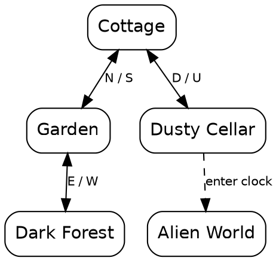

# zmap.py — Inform 6 Map Generator

`zmap.py` parses an Inform 6 source file (`.inf`) and generates a Graphviz DOT
map of the game world: rooms and the directional connections between them.

## What code it can handle

`zmap.py` works by **static source parsing** — it reads the `.inf` file, not
the compiled story file. It detects:

- **Room objects** — any `Object` declaration that has at least one directional
  property (`n_to`, `s_to`, `e_to`, `w_to`, `u_to`, `d_to`, `in_to`, `out_to`),
  or has `has light` / `has scored` without item-specific properties (`name`,
  `initial`). The latter catches dead-end rooms with no exits (e.g., Alien
  World in the test game).
- **Directional connections** — the eight standard direction properties above.
  Bidirectional pairs (e.g., `n_to` / `s_to` between two rooms) are merged into
  a single edge with a combined label like "N / S".
- **Object labels** — the short name string from `Object Name "Label"` is used
  as the node label.

### What it does NOT detect

- **Dynamic connections** — any connection set in a `before` routine,
  `react_before`, `Initialise`, or runtime logic. For example, the grandfather
  clock teleport in the test game is coded as a `before` routine on the clock
  object, not as a directional property on a room. The parser cannot see it.
  Use the `--edge` flag to add these manually.
- **Conditional exits** — a direction property whose value is a routine
  (e.g., `n_to "The door is locked."`) is not followed; the parser matches
  the literal target name only.
- **Door objects** — doors defined with `door_to` are not parsed.
- **Room contents** — items, NPCs, and containers are not shown; only rooms
  and connections.

### Source style requirements

The parser expects standard Inform 6 object syntax:

```inform
Object RoomName "Room Label"
    with description "...",
    n_to NextRoom,
    s_to PreviousRoom,
    has light;
```

It will not parse:

- Objects declared with `Class` (Inform 6 class definitions)
- Direction properties whose value is a string or routine rather than an
  object name (e.g., `n_to "The door is locked."` or `n_to DoorIsOpen`)
- Direction properties that are part of a larger expression or computed at
  runtime

If your source uses standard `Object` declarations with inline directional
properties (the common Inform 6 pattern), the parser will handle it.

## Usage

```bash
# Print DOT to stdout
python zmap.py adventure_lovecraft.inf

# Write DOT to a file
python zmap.py adventure_lovecraft.inf -o map.dot

# Render to PNG (requires Graphviz 'dot' on PATH)
python zmap.py adventure_lovecraft.inf --png map.png

# Render to SVG (requires Graphviz 'dot' on PATH)
python zmap.py adventure_lovecraft.inf --svg map.svg
```

### Manual edges

For dynamic connections the parser cannot detect (teleports, conditional
exits, runtime moves), add them with `--edge`:

```bash
python zmap.py adventure_lovecraft.inf \
    --edge "Cellar:Alien World:enter clock:dashed"
```

Format: `From:To:Label[:style]`

- `From` and `To` are room **labels** (the string from `Object Name "Label"`),
  not internal names.
- `Label` is the edge label text (e.g., "enter clock").
- `style` is optional; defaults to `dashed`. Common values: `dashed`,
  `dotted`, `bold`. Can be comma-separated for multiple attributes (e.g.,
  `dashed,blue`).

Multiple `--edge` flags can be used to add several manual edges.

## Example

From the test game `adventure_lovecraft.inf`:

```bash
python zmap.py adventure_lovecraft.inf --edge "Cellar:Alien World:enter clock:dashed"
```

Output:



This matches the game map:

```
Cottage --N--> Garden --E--> Forest
  |D
  v
Cellar  ==[enter clock]==>  Alien World
```

The four standard connections (N/S, D/U, E/W) were detected automatically from
the source's `n_to`, `s_to`, `e_to`, `w_to`, `u_to`, `d_to` properties. The
clock teleport (a `before` routine on the clock object) was added manually via
`--edge` since it has no directional property.

## Rendering

If Graphviz `dot` is installed, `--png` and `--svg` will render directly:

```bash
python zmap.py adventure_lovecraft.inf --png map.png
```

If `dot` is not available, the DOT output can be rendered online at
[webgraphviz.com](http://www.webgraphviz.com/) or any Graphviz viewer.
